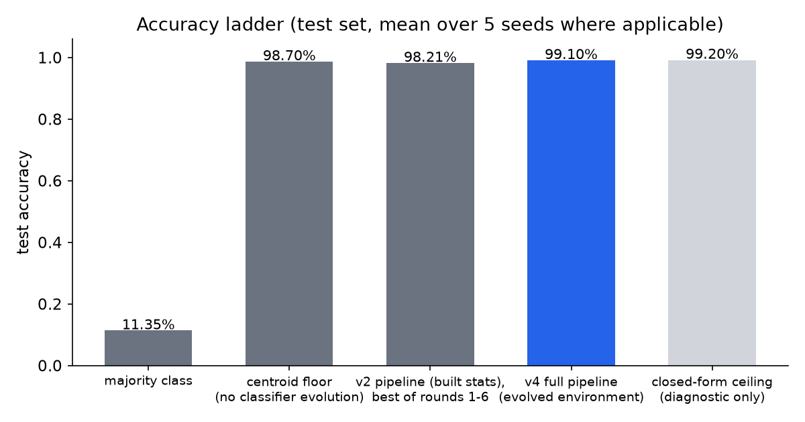
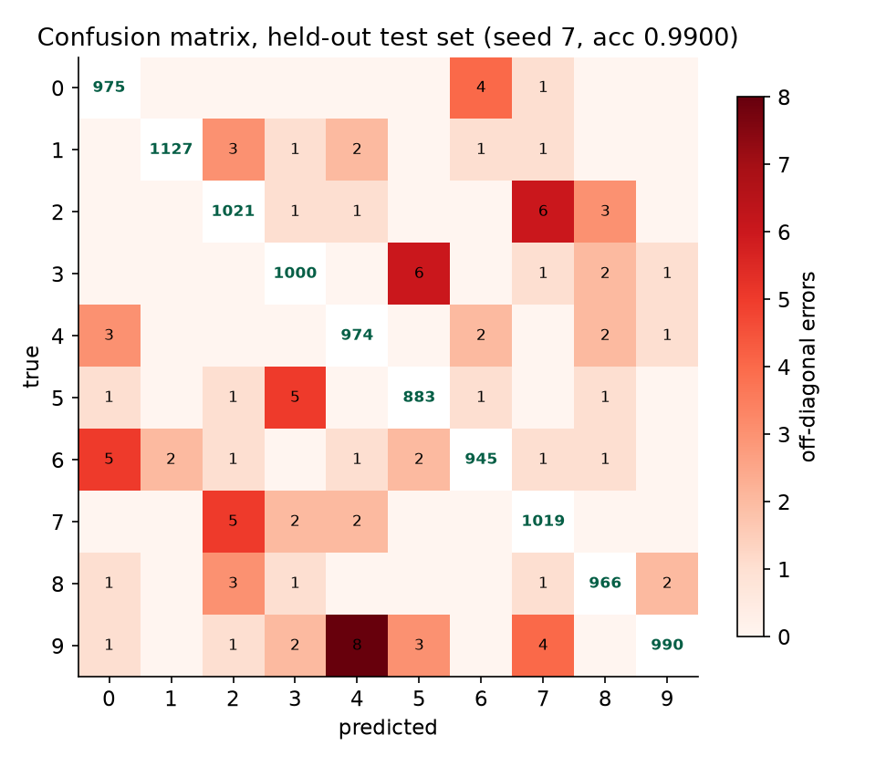
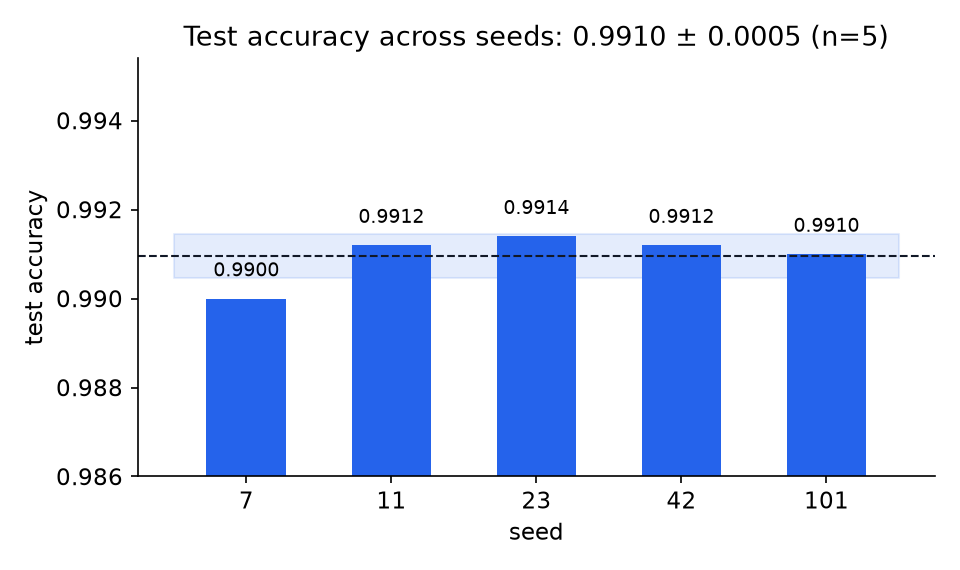
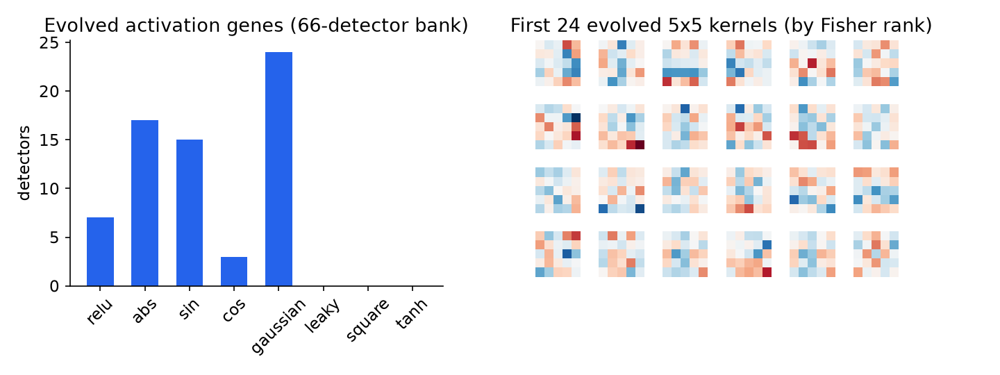
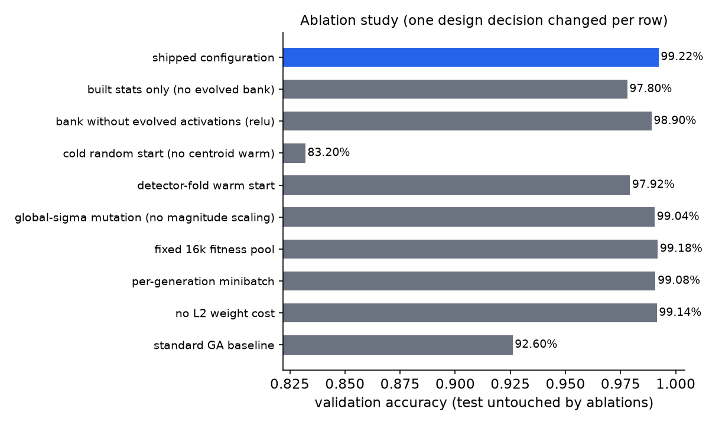

# GENREG MNIST 2.0

A gradient-free MNIST classifier. Every learned parameter in the system is
produced by selection: the convolutional feature detectors are evolved, the
classifier head is evolved, and the auxiliary referee classifiers are
evolved. There is no backpropagation, no gradient, and no closed-form fit in
the model. (A closed-form logistic regression appears once in the
experiments as a diagnostic ceiling estimate; its weights are never used.)

## Results

| | |
|---|---|
| Test accuracy (5 seeds, full pipeline re-run per seed) | **99.10% ± 0.05%** (min 99.00, max 99.14) |
| Best single run | 99.14% |
| Evolved parameters at inference | ~15,300 (66 detector genomes + one 1024x10 linear head) |
| Evolved-weight checkpoint | 47 KB |
| Fixed environment constants (PCA projection, derivable from training data) | ~9.5 MB |
| Training wall-clock per seed (RTX 4080, fitness on GPU) | 10-21 min (median 11 min) |

Context (learned parameters, checkpoint, accuracy):

| Model | Learned params | Accuracy | Checkpoint |
|---|---|---|---|
| MANTIS (predecessor: evolved features, least-squares readout) | 50K | 98.55% | 40 KB |
| LeNet-5 (backprop CNN) | 60K | 99.05% | ~250 KB |
| GENREG MNIST 2.0 (evolution end to end) | ~15.3K | 99.10% ± 0.05% | 47 KB (+9.5 MB fixed PCA) |







## How it works

Three stages, each with its own survival condition; full detail in
[docs/METHOD.md](docs/METHOD.md).

1. **Environment.** Built image statistics (deskew, zone densities,
   profiles, gradient histograms, pixel PCA; 677 dims, unsupervised) are
   concatenated with the pooled responses of an **evolved detector bank**:
   66 genomes, each a 5x5 convolution kernel plus a bias plus an evolved
   activation gene from an 8-function catalog, selected on Fisher
   class-separability of its own pooled response map and decorrelated under
   a correlation cap. The concatenation is PCA-reduced to 1024 dims and
   frozen. The classifier never sees pixels.

2. **Classifier genome.** One linear head (10,250 genes) warm-started from
   the class-centroid statistic and evolved on a deterministic fitness
   landscape: mean log-softmax probability of the true digit over the full
   55,000-image training set, minus an L2 weight cost. Tournament selection
   with elitism and starvation; self-adaptive mutation scaled per-gene by
   the gene's own magnitude.

3. **Referees and gating.** 45 one-vs-one genomes referee close top-2
   decisions, enabled only if a validation-selected margin says they help.
   On the final configuration the gate selects margin 0 for 4 of 5 seeds:
   the head sits near the environment ceiling and the referees are
   correctly disabled.



## Quick start

```
pip install numpy                    # torch optional (GPU); matplotlib optional (charts)
python scripts/download_data.py     # MNIST idx files -> corpora/mnist/
python scripts/evaluate.py          # rebuilds the environment, evaluates the shipped checkpoint
```

## Training from scratch

```
python scripts/train_full.py --seed 7        # full pipeline, one seed
python scripts/run_seeds.py                  # the 5-seed protocol (writes results JSON)
python scripts/run_ablations.py              # the ablation battery
python scripts/make_charts.py                # regenerate charts from results
```

With a CUDA GPU a full seed takes roughly 11 minutes; CPU-only, expect
several hours (the fitness evaluations fall back to numpy automatically).

## Experimental hygiene

- **Multiple random seeds.** The headline number is the mean and standard
  deviation over 5 seeds (7, 11, 23, 42, 101), where each seed re-runs the
  entire pipeline: bank evolution, environment build, classifier evolution,
  referee evolution, and gating. Per-seed results, confusion matrices, and
  timings are in `results/seeds.json`.
- **Test set never used during evolution.** All fitness is computed on the
  55,000-image training split. The test set is evaluated exactly once per
  seed, after every selection decision is frozen.
- **Validation set used for model selection.** Champions at every stage and
  the referee margin are selected on a fixed 5,000-image validation split
  carved off the training set. The validation-to-test gap is reported per
  seed (0.04-0.18 points across the five seeds).
- **Compute budget.** Per seed on one RTX 4080 (fitness evaluations on GPU
  under torch no_grad, TF32 disabled; everything else numpy on CPU):
  bank evolution 79-219 s, environment build 93-126 s, classifier evolution
  100-153 s, referees 341-815 s; total 619-1288 s. CPU fallback is 30-60x
  slower on the large stages.
- **Fitness evaluations.** Per seed: 138,240 bank genome-evaluations (2,500
  images each), 360,000 classifier genome-evaluations (55,000 images each,
  about 2.0e10 image-genome evaluations), 10,125,000 referee
  genome-evaluations (512 images each).
- **Full reproducibility.** All seeds are explicit, every stage is
  deterministic given its seed, and the code in this repository is the code
  that produced the numbers. `scripts/run_seeds.py` regenerates
  `results/seeds.json` end to end. GPU and CPU fitness paths agree to under
  5e-7; identical seeds reproduce identical bank compositions.
- **Ablations.** Every major design decision is removed or replaced one at
  a time in `scripts/run_ablations.py`, reported on validation (the test
  set is reserved for the shipped configuration): the evolved bank vs built
  statistics alone, evolved activation genes vs relu-only, centroid warm
  start vs detector-fold vs cold, magnitude-scaled vs global-sigma
  mutation, full-training-set fitness vs fixed-pool vs per-generation
  minibatch, and the L2 cost. Results in `results/ablations.json` and the
  chart below.
- **Standard GA baseline.** The classic configuration (cold start, global
  sigma, per-generation minibatch fitness) is run on the identical
  environment and budget as a comparison cell in the same table.
- **Failure cases.** Documented with the evidence that cut them in
  [docs/FAILURES.md](docs/FAILURES.md): a random-Fourier feature lift,
  shift augmentation, small fitness pools (memorized), the detector-fold
  warm start, and referee behavior at the environment ceiling.
- **Limitations.** Stated in [docs/LIMITATIONS.md](docs/LIMITATIONS.md),
  including the environment ceiling, the size of the fixed PCA constants,
  validation-set consumption by repeated gating, and the open problem of
  transferring the recipe to natural images.



## Repository layout

```
genreg_mnist/mnist_pipe.py   the full pipeline (data, environment, genomes, batteries)
genreg_mnist/evo_gpu.py      GPU fitness evaluation (optional; CPU fallback automatic)
scripts/                     download, train, evaluate, seeds, ablations, charts
checkpoints/                 shipped bank + classifier checkpoints
results/                     seeds.json, ablations.json
docs/                        METHOD.md, FAILURES.md, LIMITATIONS.md
```

## License

MIT.
